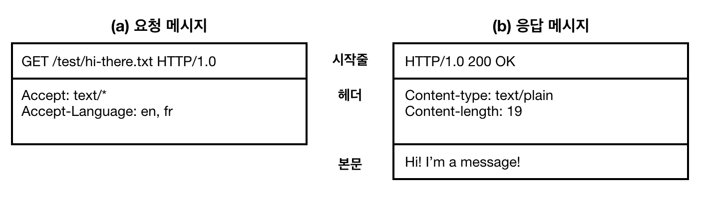

# 01. HTTP 개관

## 요약
- 웹 서버와 웹 클라이언트는 HTTP 프로토콜에서 정의된 형식로 의사소통하기로 약속했다.
- HTTP 프로토콜에서 정의한 형식으로 만든 메시지를 HTTP 메시지라 한다.
- 작성된 HTTP 메시지는 TCP/IP 프로토콜을 통해 서버/클라이언트로 전송된다.
- HTTP 프로토콜로 통신하는 애플리케이션에는 프록시, 캐시, 게이트웨이 터널 등이 있다.
- 현재의 HTTP 버전은 HTTP/1.1이며, HTTP/2.0은 설계가 진행 중이다.

## HTTP 프로토콜: 웹 서버와 웹 클라이언트가 대화하는 규칙

### 웹 서버와 웹 클라이언트 구조

- 웹 서버는 웹 리소스를 저장하고 있다.
- 웹 클라이언트는 웹 서버에 리소스를 요청한다.
- 웹 서버는 요청한 리소스를 웹 클라이언트에 전해준다.

### HTTP 프로토콜

웹 서버와 웹 클라이언트가 소통할 규칙을 정해놓은 것
- 요청할 때: _요청대상_ 과 목적, 기타 정보를 전달
- 응답할 때: 요청이 잘 처리되었는 지, 요청한 데이터, _요청한 데이터의 형태_, 기타 정보를 전달

URI: 요청대상을 표현하는 규칙
- URL과 URN 두 가지 방식으로 표기할 수 있음
- 통상적으로 URI라 하면 URL을 말함(URN 방식은 아직까지 많이 활용되지 않기 때문)
- URL: `프로토콜://리소스/상대경로` 형식, 리소스의 위치가 변경되면, 조회할 수 없음
  예) www.youjung.hong/index.html
- URN: 리소스가 저장된 위치와 상관없는 리소스의 주소, 리소스의 위치가 변경되어도 조회가능

MIME 타입: 요청한 데이터의 형태
- 전달하는 데이터의 형태를 응답 시 표기한다.
- 예:
  - text/html: HTML로 작성된 텍스트 문서
  - text/plain: plain ASCII 텍스트 문서
  - image/jpeg: JPEG 이미지
  - image/gif: GIF 이미지
  - video/quicktime: 애플 퀵타임 동영상
  - application/vnd.ms-powerpoint: 마이크로소프트 파워포인트 프레젠테이션
  - application/json: JSON 포맷

트랜잭션: 요청과, 요청에 대한 응답으로 구성
- HTTP 메시지라 불리는 정형화된 포맷을 통해 이루어짐
- 웹 페이지 한 개는 여러 개의 리소스를 담고 있을 수 있고, 이 때 각각의 리소스를 요청하고 전달받는 것은 개별적인 트랜잭션으로 이뤄짐

### HTTP 메시지

**HTTP 메시지의 구조**



- 시작줄: 
  - 요청 시: 무엇을 해야 하는 가 `{메서드} {URI} {HTTP 버전}`
  - 응답 시: 요청에 대해 무슨 일이 일어났는 가 `{HTTP 버전} {상태코드} {응답설명}`
- 헤더: 
  - 한 줄에 `:`로 구분되는 하나의 키와 하나의 값으로 이루어짐
  - 항상 빈 줄로 끝남
- 본문: 이진/텍스트 등 어떤 종류의 데이터도 들어갈 수 있음

**자주 쓰이는 메서드 몇 가지**
- GET: 서버에서 클라이언트로 지정한 리소스를 보내라
- PUT: 클라이언트에서 서버로 보낸 데이터를 지정한 이름의 리소스로 저장하라
- DELETE: 지정한 리소스를 서버에서 삭제하라
- POST: 클라이언트 데이터를 서버 게이트웨이 애플리케이션으로 보내라 
- HEAD: 지정한 리소스에 대한 응답에서, HTTP 헤더 부분만 보내라

**자주 쓰이는 상태코드 몇 가지**
- 200: 좋다. 문서가 바르게 반환되었다
- 302: 다시 보내라. 다른 곳에 가서 리소스를 가져가라
- 404: 없음. 리소스를 찾을 수 없다

## TCP/IP: HTTP 메시지는 어떻게 전송되는 가

### TCP/IP

HTTP는 요청/응답 메시지의 형식에 관한 규칙
이 메시지 전송은 TCP/IP 프로토콜을 통해 이루어짐
TCP/IP 연결을 위해서 IP주소와 포트번호가 필요함

### 웹브라우저에서 URL의 화면을 보여주기까지의 과정

URL에서 IP주소와 포트번호를 추출하여 TCP/IP 연결을 맺고, HTTP 요청을 보냄

**URL의 예**
```
[1] http://207.200.83.29:80/index.html
[2] http://www.netscape.com:80/index.html
[3] http://www.netscape.com/index.html
```
- `1` IP주소:포트번호/리소스 경로
- `2` 호스트명:포트번호/리소스경로 - DNS로 호스트명를 IP주소로 변환함
- `3` 호스트명/리소스경로 - 포트번호가 생략된 경우, http의 기본 포트번호 80을 사용

**웹브라우저에서 URL의 화면을 보여주기까지의 과정**

```
# TCP/IP 커넥션 맺기
[1] 웹 브라우저는 서버의 URL에서 호스트 명을 추출
[2] 웹 브라우저는 서버의 호스트명을 IP로 변환
[3] 웹 브라우저는 URL에서 포트번호(있다면)를 추출
[4] 웹 브라우저는 웹 서버와 TCP/IP 연결을 맺음
# HTTP 요청하기
[5] 웹 브라우저는 서버에 HTTP 요청을 보냄
[6] 서버는 웹 브라우저에 HTTP 응답을 돌려줌
[7] 커넥션이 닫히면, 웹 브라우저는 문서를 보여줌
```

## HTTP 애플리케이션의 예

### 프락시
클라이언트와 서버 사이에서 트래픽을 전달
예) 주로 보안을 위해 사용: 요청과 응답을 필터링

### 캐시
자주 찾는 문서의 사본을 저장

### 게이트웨이
HTTP 트래픽을 다른 프로토콜로 변환하기 위해 사용

### 터널
비 HTTP 데이터를 하나 이상의 HTTP 연결을 통해 그대로 전송해주기 위해 사용
예) 암호화된 SSL 트래픽을 HTTP 커넥션으로 전송함으로써 웹 트래픽만 허용하는 사내 방화벽 통과
